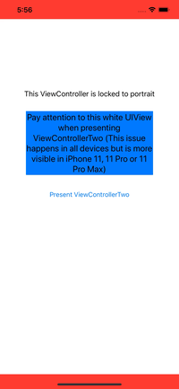

# Example Project

### Created this project just for demo purposes. I think that we might bumped into a framework limitation or bug...

I need to present a UIViewController (ViewControllerTwo) that only supports ".landscape" orientations from another UIViewController (ViewControllerOne) that only supports ".portrait" orientation. If you run the app (better with slow animations ON) you will see that when the transition occurs it shrinks the content of "ViewControllerOne" and when you dismiss "ViewControllerTwo" the same happens.

The reason why this happens is related to the change of safe areas, which in portrait are different from landscape and vice versa.

# Is this a bug/limitation from iOS?
    (NO) -> What is the right way to handle this scenario?
    (YES) -> What workaround do you recommend to solve this issue in the meantime?

